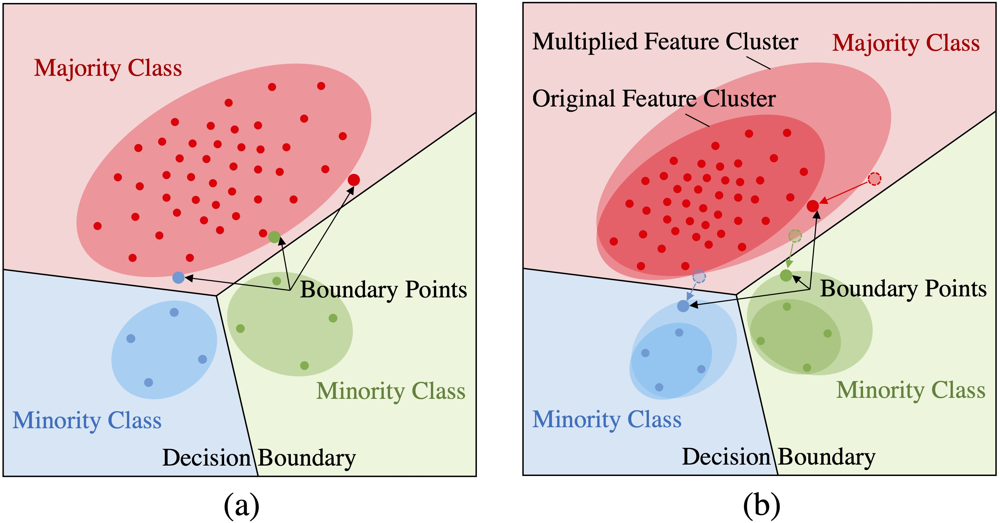
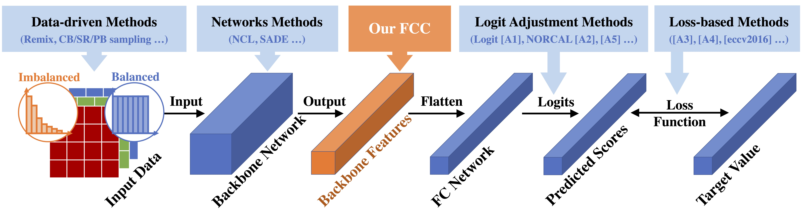

## FCC: Feature Clusters Compression for Long-Tailed Visual Recognition

This repository is the official PyTorch implementation of the paper in CVPR 2022:

**FCC: Feature Clusters Compression for Long-Tailed Visual Recognition**<br/>
[Jian Li](),
[Ziyao Meng](),
[Daqian Shi](),
[Rui Song](),
[Xiaolei Diao](),
[Jingwen Wang]() <br/>
[[PDF]()]
&nbsp;
<p align="center">

</p>
&nbsp;

## Feature Clusters Compression (FCC)

FCC is a simple and generic method for long-tailed visual recognition, which can be easily achieved and friendly combined with existing long-tailed methods to further boost them. FCC works on backbone features from the last layer of backbone networks. The core code of FCC is available at "lib/fcc/fcc_functions.py".
&nbsp;
<p align="center">

</p>
&nbsp;

## Main requirements
```bash
torch >= 1.7.1 
tensorboardX >= 2.1 
tensorflow >= 1.14.0 
Python 3.6
apex
```
#### Detailed requirement
```bash
pip install -r requirements.txt
```
The [apex](https://github.com/NVIDIA/apex) **is recommended to be installed for saving GPU memories**:
```bash 
pip install -U pip
git clone https://github.com/NVIDIA/apex
cd apex
pip install -v --disable-pip-version-check --no-cache-dir --global-option="--cpp_ext" --global-option="--cuda_ext" ./
```

## Prepare datasets
**This part is mainly based on https://github.com/zhangyongshun/BagofTricks-LT and https://github.com/Bazinga699/NCL**

Three widely used datasets are provided in this repo: long-tailed CIFAR (CIFAR-LT), long-tailed ImageNet (ImageNet-LT) and iNaturalist 2018 (iNat18). 

The detailed information of these datasets are shown as follows:

<table>
<thead>
  <tr>
     <th align="center" rowspan="3">Datasets</th>
     <th align="center" colspan="2">CIFAR-10-LT</th>
     <th align="center" colspan="2">CIFAR-100-LT</th>
     <th align="center" rowspan="3">ImageNet-LT</th>
     <th align="center" rowspan="3">iNat18</th>
  </tr>
  <tr>
    <td align="center" colspan="4"><b>Imbalance factor</b></td>
  </tr>
  <tr>
     <td align="center" ><b>100</b></td>
     <td align="center" ><b>50</b></td>
     <td align="center" ><b>100</b></td>
     <td align="center" ><b>50</b></td>
  </tr>
</thead>
<tbody>
  <tr>
     <td align="center" style="font-weight:normal">    Training images</td>
     <td align="center" style="font-weight:normal">  12,406 </td>
     <td align="center" style="font-weight:normal">  13,996  </td>
     <td align="center" style="font-weight:normal">  10,847  </td>
     <td align="center" style="font-weight:normal"> 12,608 </td>
     <td align="center" style="font-weight:normal">11,5846</td>
     <td align="center" style="font-weight:normal">437,513</td>
  </tr>
  <tr>
     <td align="center" style="font-weight:normal">    Classes</td>
     <td align="center" style="font-weight:normal">  50  </td>
     <td align="center" style="font-weight:normal">   50 </td>
     <td align="center" style="font-weight:normal">   100 </td>
     <td align="center" style="font-weight:normal">  100  </td>
     <td align="center" style="font-weight:normal"> 1,000 </td>
     <td align="center" style="font-weight:normal">8,142</td>
  </tr>
  <tr>
     <td align="center" style="font-weight:normal">Max images</td>
     <td align="center" style="font-weight:normal">5,000</td>
     <td align="center" style="font-weight:normal">5,000</td>
     <td align="center" style="font-weight:normal">500</td>
     <td align="center" style="font-weight:normal">500</td>
     <td align="center" style="font-weight:normal">1,280</td>
     <td align="center" style="font-weight:normal">1,000</td>
  </tr>
  <tr>
     <td align="center" style="font-weight:normal" >Min images</td>
     <td align="center" style="font-weight:normal">50</td>
     <td align="center" style="font-weight:normal">100</td>
     <td align="center" style="font-weight:normal">5</td>
     <td align="center" style="font-weight:normal">10</td>
     <td align="center" style="font-weight:normal">5</td>
     <td align="center" style="font-weight:normal">2</td>
  </tr>
  <tr>
     <td align="center" style="font-weight:normal">Imbalance factor</td>
     <td align="center" style="font-weight:normal">100</td>
     <td align="center" style="font-weight:normal">50</td>
     <td align="center" style="font-weight:normal">100</td>
     <td align="center" style="font-weight:normal">50</td>
     <td align="center" style="font-weight:normal">256</td>
     <td align="center" style="font-weight:normal">500</td>
  </tr>
</tbody>
</table>
-"Max images" and "Min images" represents the number of training images in the largest and smallest classes, respectively.


-"CIFAR-10-LT-100" means the long-tailed CIFAR-10 dataset with the imbalance factor beta = 100.


-"Imbalance factor" is defined as: beta = Max images / Min images.

- #### Data format

The annotation of a dataset is a dict consisting of two field: `annotations` and `num_classes`.
The field `annotations` is a list of dict with
`image_id`, `fpath`, `im_height`, `im_width` and `category_id`.

Here is an example.
```
{
    'annotations': [
                    {
                        'image_id': 1,
                        'fpath': '/data/iNat18/images/train_val2018/Plantae/7477/3b60c9486db1d2ee875f11a669fbde4a.jpg',
                        'im_height': 600,
                        'im_width': 800,
                        'category_id': 7477
                    },
                    ...
                   ]
    'num_classes': 8142
}
```
- #### CIFAR-LT

  [Cui et al., CVPR 2019](https://arxiv.org/abs/1901.05555) firstly proposed the CIFAR-LT. They provided the [download link](https://github.com/richardaecn/class-balanced-loss/blob/master/README.md#datasets) of CIFAR-LT, and also the [codes](https://github.com/richardaecn/class-balanced-loss/blob/master/README.md#datasets) to generate the data, which are in TensorFlow. 

     You can follow the steps below to get this version of  CIFAR-LT:

     1. Download the Cui's CIFAR-LT in [GoogleDrive](https://drive.google.com/file/d/1NY3lWYRfsTWfsjFPxJUlPumy-WFeD7zK/edit) or [Baidu Netdisk ](https://pan.baidu.com/s/1rhTPUawY3Sky6obDM4Tczg) (password: 5rsq). Suppose you download the data and unzip them at path `/downloaded/data/`.
     2. Run tools/convert_from_tfrecords, and the converted CIFAR-LT and corresponding jsons will be generated at `/downloaded/converted/`.

  ```bash
  # Convert from the original format of CIFAR-LT
  python tools/convert_from_tfrecords.py  --input_path /downloaded/data/ --output_path /downloaded/converted/
  ```

- #### ImageNet-LT

  You can use the following steps to convert from the original images of ImageNet-LT.

  1. Download the original [ILSVRC-2012](http://www.image-net.org/). Suppose you have downloaded and reorgnized them at path `/downloaded/ImageNet/`, which should contain two sub-directories: `/downloaded/ImageNet/train` and `/downloaded/ImageNet/val`.
  2. Directly replace the data root directory in the file `dataset_json/ImageNet_LT_train.json`, `dataset_json/ImageNet_LT_val.json`,You can handle this with any editor, or use the following command.

  ```bash
  # replace data root
  python tools/replace_path.py --json_file dataset_json/ImageNet_LT_train.json --find_root /media/ssd1/lijun/ImageNet_LT --replaces_to /downloaded/ImageNet
  
  python tools/replace_path.py --json_file dataset_json/ImageNet_LT_val.json --find_root /media/ssd1/lijun/ImageNet_LT --replaces_to /downloaded/ImageNet
  
  ```

- #### iNat18
  
  You can use the following steps to convert from the original format of iNaturalist 2018. 
  
  1. The images and annotations should be downloaded at [iNaturalist 2018](https://github.com/visipedia/inat_comp/blob/master/2018/README.md) firstly. Suppose you have downloaded them at  path `/downloaded/iNat18/`.
  2. Directly replace the data root directory in the file `dataset_json/iNat18_train.json`, `dataset_json/iNat18_val.json`,You can handle this with any editor, or use the following command.

  ```bash
  # replace data root
  python tools/replace_path.py --json_file dataset_json/iNat18_train.json --find_root /media/ssd1/lijun/inaturalist2018/train_val2018 --replaces_to /downloaded/iNat18
  
  python tools/replace_path.py --json_file dataset_json/iNat18_val.json --find_root /media/ssd1/lijun/inaturalist2018/train_val2018 --replaces_to /downloaded/iNat18
  
  ```

## Usage
First, prepare the dataset and modify the relevant paths in configs/FCC/xxx.yaml
#### Parallel training with DataParallel 

```bash
1, Train
# Train long-tailed CIFAR-100 with imbalanced ratio of 100. 
# In run.sh, `GPUs` are the GPUs you want to use, such as '0' or`0,1,2,3`.
bash run.sh

2, If you want to train different methods with FCC.
# Just modify the "configs/xxx.ymal" in run.sh.
```

## Acknowledgements
This is a project based on [Bag of tricks](https://github.com/zhangyongshun/BagofTricks-LT).
